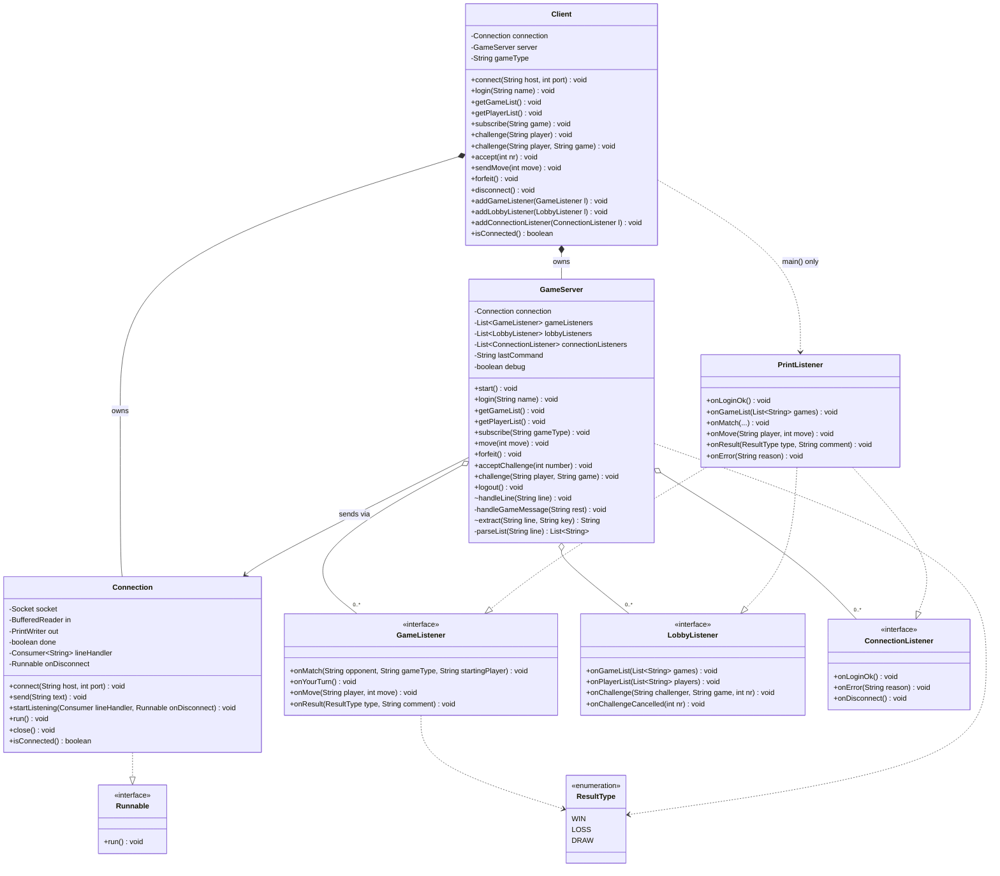

# Network package: UML class diagram

```mermaid
classDiagram
direction TB

class Client {
  -Connection connection
  -GameServer server
  -String gameType
  +connect(String host, int port) void
  +login(String name) void
  +getGameList() void
  +getPlayerList() void
  +subscribe(String game) void
  +challenge(String player) void
  +challenge(String player, String game) void
  +accept(int nr) void
  +sendMove(int move) void
  +forfeit() void
  +disconnect() void
  +addGameListener(GameListener l) void
  +addLobbyListener(LobbyListener l) void
  +addConnectionListener(ConnectionListener l) void
  +isConnected() boolean
}

class GameServer {
  -Connection connection
  -List~GameListener~ gameListeners
  -List~LobbyListener~ lobbyListeners
  -List~ConnectionListener~ connectionListeners
  -String lastCommand
  -boolean debug
  +start() void
  +login(String name) void
  +getGameList() void
  +getPlayerList() void
  +subscribe(String gameType) void
  +move(int move) void
  +forfeit() void
  +acceptChallenge(int number) void
  +challenge(String player, String game) void
  +logout() void
  ~handleLine(String line) void
  -handleGameMessage(String rest) void
  ~extract(String line, String key) String
  -parseList(String line) List~String~
}

class Connection {
  -Socket socket
  -BufferedReader in
  -PrintWriter out
  -boolean done
  -Consumer~String~ lineHandler
  -Runnable onDisconnect
  +connect(String host, int port) void
  +send(String text) void
  +startListening(Consumer lineHandler, Runnable onDisconnect) void
  +run() void
  +close() void
  +isConnected() boolean
}

class Runnable {
  <<interface>>
  +run() void
}

class GameListener {
  <<interface>>
  +onMatch(String opponent, String gameType, String startingPlayer) void
  +onYourTurn() void
  +onMove(String player, int move) void
  +onResult(ResultType type, String comment) void
}

class LobbyListener {
  <<interface>>
  +onGameList(List~String~ games) void
  +onPlayerList(List~String~ players) void
  +onChallenge(String challenger, String game, int nr) void
  +onChallengeCancelled(int nr) void
}

class ConnectionListener {
  <<interface>>
  +onLoginOk() void
  +onError(String reason) void
  +onDisconnect() void
}

class PrintListener {
  +onLoginOk() void
  +onGameList(List~String~ games) void
  +onMatch(...) void
  +onMove(String player, int move) void
  +onResult(ResultType type, String comment) void
  +onError(String reason) void
}

class ResultType {
  <<enumeration>>
  WIN
  LOSS
  DRAW
}

Client *-- Connection : owns
Client *-- GameServer : owns
GameServer --> Connection : sends via
Connection ..|> Runnable
GameServer o-- "0..*" GameListener
GameServer o-- "0..*" LobbyListener
GameServer o-- "0..*" ConnectionListener
PrintListener ..|> GameListener
PrintListener ..|> LobbyListener
PrintListener ..|> ConnectionListener
GameListener ..> ResultType
GameServer ..> ResultType
Client ..> PrintListener : main() only
```
